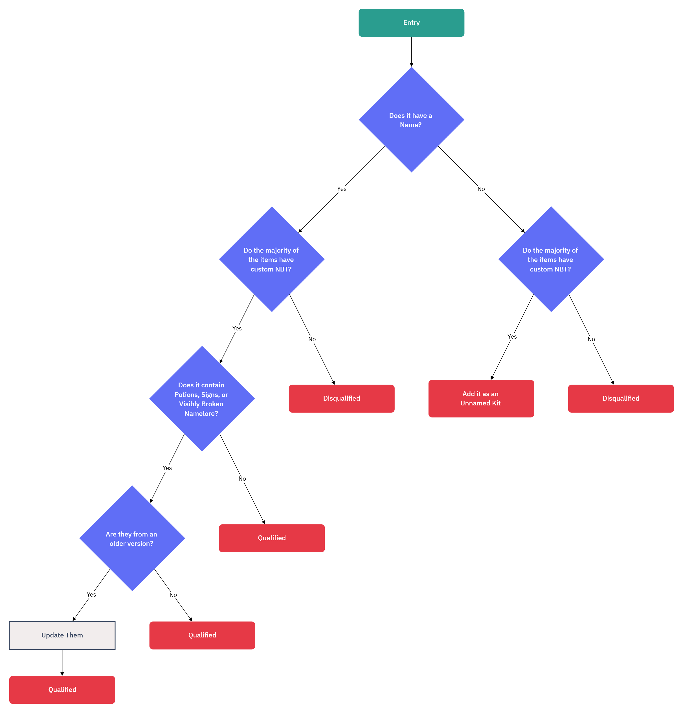

# The Shulker Archives Guidelines
This document is intended to serve as a reference for Kaddicus (and any future Archivists) for the process in adding new entries; Everything from sourcing them to creating the database entry and changelog is covered.

If you have tools or suggestions to improve any aspect of the process, please send them to [Discord](https://discord.gg/cfq25qURfv) or [Issues](https://github.com/KadTheHunter/ShulkerArchives/issues).

## Prerequisites
- [Minecraft](https://www.minecraft.net/en-us)
  - [Fabric Loader](https://fabricmc.net/)
    - [NBT Editor](https://modrinth.com/mod/nbt-editor)
    - [IBE Editor](https://modrinth.com/mod/ibe-editor)
    - [Sign Edit Lite](https://modrinth.com/mod/signeditlite)
    - [QuickCoords Copy](https://github.com/KadTheHunter/QuickCoordsCopy/releases/latest) (Kaddicus' Fork)
- [WebStorm](https://www.jetbrains.com/webstorm/)
  - [CSV Editor Plugin](https://plugins.jetbrains.com/plugin/10037-csv-editor)
- [GitHub Account](https://github.com/)
  - [Access to The Shulker Archives Repository](https://github.com/KadTheHunter/ShulkerArchives)
- [Web Browser](https://www.mozilla.org/en-US/firefox/new/) (Firefox preferred)

## Sourcing Entries
There are three ways to sourc entries:
1. Submitted Entries - These are entries sent in by the community.
2. Ripped Entries - These are entries ripped from a server, typically done in bulk from a Plot or other large collection. Ripped entries are not as common nowadays, but do still exist.
3. Found Entries - These are entries found on servers such as NBT Archives, and saved locally.

All sourced entries **MUST** be checked through the Database before proceeding to the next steps. If an existing entry is found, it **MUST** be compared to the sourced entry to determine any differences.
 
Once sourced and checked, move on to [Qualifying](#qualifying)

## Qualifying
Please refer to the below flowchart to Qualify entries:


*TL;DR: If it has a name, is mostly custom NBT and little to no vanilla NBT, and outdated/broken items are updated/repaired, its qualified; If all points but name are met, its qualified as an Unnamed Kit, and if any other points fail, it's disqualified.*

## Categorizing Entries
All entries will fall into one of two umbrella categories:

### Functional
These entries have a use or purpose; They do or provide something. Examples of Functional entries include Weapons, Potions, Exploits and Spawn Eggs Non-Functional
The subcategories are as follows:

#### PvP
Kits may be categorized as PvP only if they meet all the following requirements:
- Contains at least one Melee Weapon (or Item intended as a Melee Weapon)
- Contains at least two pieces of Armor (Player Heads and Elytra do not count as armor on their own, but do count when paired with other armor pieces)
- Items must be themed and/or arranged in a way that indicates they form a Kit, not a random collection of PvP items
If these three requirements are met, it can be categorized as a PvP Kit

#### PvP (Related)
Kits may be categorized as PvP (Related) if they meet the following requirement:
- Contains items meant to deal or negate damage
If this single requirement is met, it can be categoirized as a PvP (Related) Kit

#### Abuse
Kits may be categorized as Abuse if they meet the following requirements:
- Contains items used to Troll, Exploit, Attack or otherwise "Abuse" servers and worlds
- Primary focus is on Trolling/Exploiting
If these requirements are met, it can be categorized as an Abuse Kit

#### Utilities
Kits may be categorized as Utilities if they meet the following requirement:
- **Only** contains items that provide useful features, tools or services to the player
If this requirement is met, it can be categorized as a Utility Kit

#### Misc. Functional
Kits may be categorized as Misc. Functional if they do not fall into any other Functional category

### Non-Functional
These entries do not have a use or purpose; They only provide visuals. Examples of Non-Functional entries include Loreart and Themed Items
The subcategories are as follows:

#### Lore
Kits may be categorized as Lore if they meet all the following requirements:
- Contains at least one item with >5 lines of lore *OR* two items with >3 lines of lore
- Items lore is stylized 
If this requirement is met, it can be categorized as a Lore Kit

#### Random
Kits may be categorized as Random if the items within have no lore and/or have no relation to one-another.

#### Misc. Non-Functional
Kits may be categorized as Misc. Non-Functional if they do not fall into any other Non-Functional category

## Adding Entries
Adding new entries requires adding them to the correct location on the map, copying the coordinates and entering them along with the Name/Author/etc. in the Database, and adding the name to the appropriate section of the relevant Changelog.

### Map
1. Locate the appropriate location for the entry
2. Find the next available barrel
3. Place the entry in the exact center of the barrel
4. Choose the correct size sign for the entry name, place it, and modify the Name and Author to match
5. Decide if the entry is an Archivist Pick, following [AP Guidelines](#ap-guidelines)
6. Stay near the entry, and begin the process of [Database](#database)

### Database
1. Position yourself in front of the barrel so that your head is level with the relevant sign
2. Using QuickCoordsCopy, copy the coordinates
3. Test the copied coordinates to ensure they are proper

⚠️ **IMPORTANT** ⚠️

ALWAYS check your coordinates before pasting into the database. QCC (specifically my fork) has an unresolved bug where the Yaw coordinate sometimes returns cumulative or sticky, resulting in the coordinate given being visually or literally incorrect respectively.
4. Switch to WebStorm, and in the CSV file add the new entry in the format of
```CSV
Name,Author,Teleport Command,Notes,Category,Entry Type
```
Notes should be left blank unless the entry contains NSFW, or is an Archivist pick.

If you are adding more than one entry, place a blank line between the existing database and your new entries, so you can easily see where the new entries are.
5. Begin the process of [Changelog](#changelog)

### Changelog
1. Open the relevant Changelog
2. Locate the appropriate section and subsection for the new entry
3. At bare minimum add the Name; Author and formatting can be added and applied later
   1. *Note that if the entry is an Archivist Pick it must also be added under the appropriate subsection of Archivist Picks*
   2. *Note also that if the entry is added to a Collection or begins a new Collection, it must **only** be added under the appropriate subsection of Collections, and not in any other section.
4. If a blank line was inserted into the database to denote new entries, remove it when finished adding them to the Changelog

## AP Guidelines
Particularly good entries can be flagged as Archivist Picks, with copies placed in the Archivist Pick cutout.

In order to be an Archivist Pick, an entry must meet the following requirements:
- Kits must be nicely arranged and not in a jumble
- Items must fulfill one or more of the following:
  - Lengthy and/or well done lore, properly styled and relatively void of common tropes
  - Useful utility/tool, properly functioning and usable
  - Top of the line PvP; No common or overused Weapons/Armor

It's important to note that Archivist Picks are the cream of the crop; It's entirely possible for an entry to meet the above requirements, and still not be an Archivist Pick. The guidelines listed are exactly that: guidelines. If an entry meets them, then it's possible for it to be an Archivist Pick, but is still entirely up to the Archivist to make that decision, using their experience with the Archives to know if it really *is* an Archivist Pick.

## Collections
Entries that are part of a larger line or group of entries are typically flagged as Collections, and separated from the main body of the Archives.

Collections have similar standards as Archivist Picks, but somewhat looser; While entries in Collections must meet a certain level of quality, the primary focus is separating large "clumps" of entries from the larger Archive, reducing the strain on space and making it easier to find entries from popular series like EnderEyeGames' "Abuse Kits", MarioKartWii's "FAR Kits" or _txsla's "Tesla Kits".

New Collections can be formed if:
- All entries are linked to one another
- There is 4+ existing entries, or reason to believe there will be more coming in the future
- At least half of the initial entries meet or come close to meeting the Archivist Pick guidelines **OR** have significant historical importance

Existing collections can be added to if:
- The new entry is linked to the existing Collection


## Notes
- There will always be exceptions to the guidelines listed. There will always be that one kit added to Archivist Picks that doesn't quite meet the standards, always that one Item that could technically fit into a different category, always some sort of exception. At the end of the day, it is up to the current Archivist(s) to use their experience with the Archives to properly source, qualify, categorize and add new entries; These guidelines just serve as loose markings to prevent *too* much variance.

## Resources
The QuickCoordsCopy format is as follows:
```javascript
formatting=/tp @s $x.5 $y $z.5 $LRSnap 0
```
The `.5` ensures that users will be centered when teleporting, and `$LRSnap` will return the Yaw coordinate rounded to the nearest cardinal direction. As noted earlier, **always** check coordinates, as the Yaw coordinate returned will sometimes be cumulative or sticky, providing visually or literally incorrect coordinates respectively.